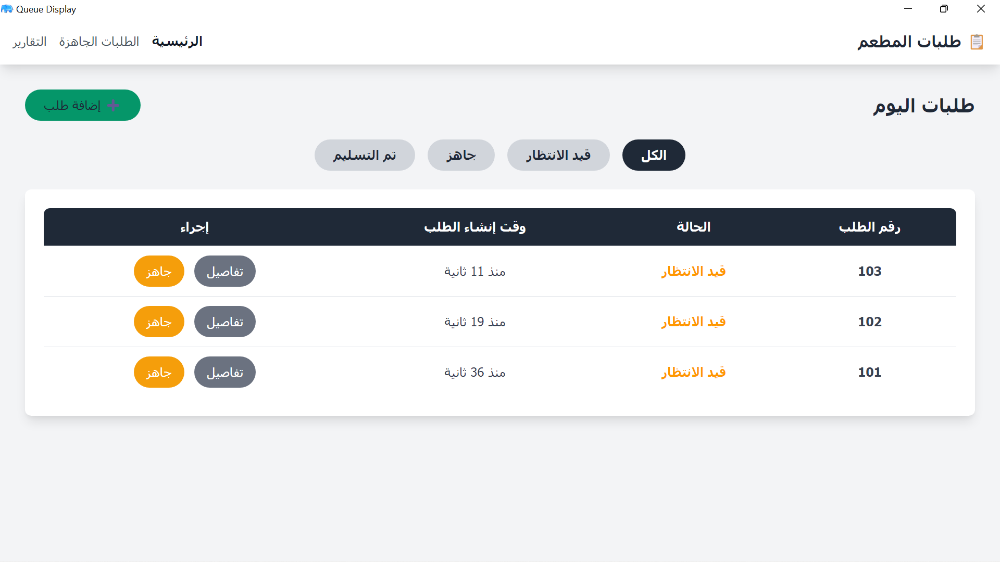
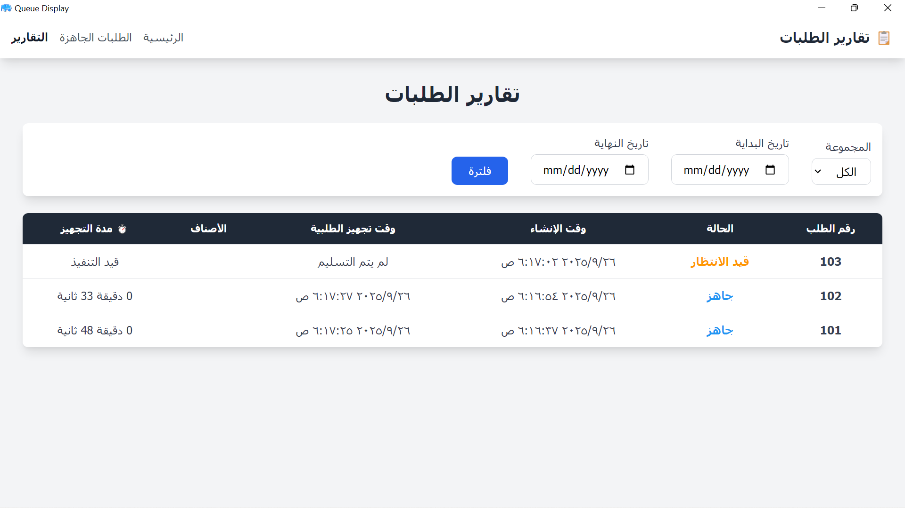
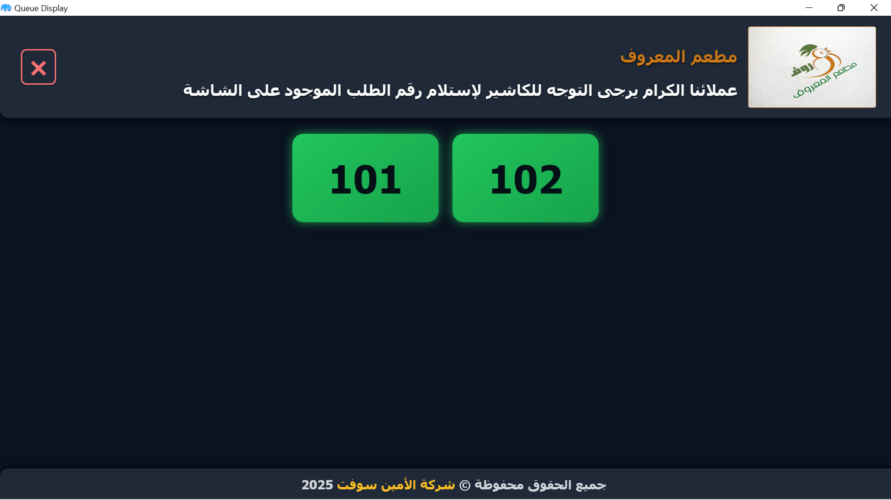

# 🍽 نظام إدارة طلبات المطعم + الربط مع نظام الأمين المحاسبي

نظام شامل لإدارة الطلبات داخل المطاعم، يتيح للموظفين والعملاء متابعة الطلبات لحظيًا، مع ربط مباشر بالنظام المحاسبي لتلقي الطلبات بعد إصدار الفواتير تلقائيًا، وتقديم تقارير مرنة لإدارة الأداء.

---

## 🎯 الهدف
- متابعة الطلبات من لحظة استلامها حتى التسليم للعميل.
- تحديث حالة الطلبات (جاهز / تم التسليم) بشكل لحظي.
- عرض شاشة للعميل تعرض أرقام الطلبات الجاهزة.
- جلب الطلبات أوتوماتيكياً من النظام المحاسبي.
- توفير تقارير مرنة للمدير لمعرفة مدة تجهيز كل طلب وتحليل الأداء.

---

## 👤 الأدوار الرئيسية

### المطبخ / الكاشير
- متابعة الطلبات الجديدة.
- تحديث حالة الطلب: جاهز أو تم التسليم.
- إصدار الفواتير مباشرة عبر الربط بالنظام المحاسبي.
- عرض تقارير الطلبات اليومية ومدة تجهيز كل طلب.

### العميل / شاشة الطلبات
- عرض أرقام الطلبات الجاهزة ومتابعة الحالة بشكل مباشر.

### الإدارة / المدير
- الوصول لتقارير أداء الطلبات مثل متوسط وقت تجهيز الطلبات.

---

## 🖼 صور المشروع

  
*واجهة عرض الطلبات للموظفين.*

  
*تقرير أداء الطلبات للإدارة.*

  
*شاشة متابعة الطلبات للعميل.*

---

## 🔧 التقنيات المستخدمة
- **Back-End:** Laravel, RESTful APIs  
- **Integration:** ربط مع نظام الأمين المحاسبي (Accounting Integration)  
- **Subscription / User Management**  
- **Version Control:** Git & GitHub  
- **Hosting:** أي سيرفر ويب داعم للـ PHP & MySQL

---

## 🚀 المميزات
- متابعة الطلبات لحظياً.
- إصدار فواتير آلي عبر الربط المحاسبي.
- تقارير مرنة للإدارة.
- شاشة مباشرة للعميل لمتابعة الطلبات.
